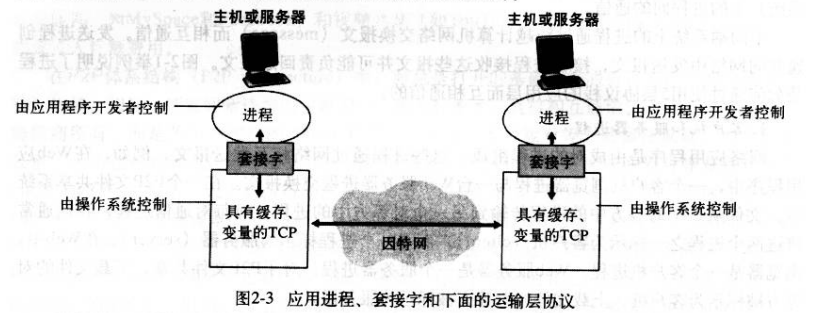
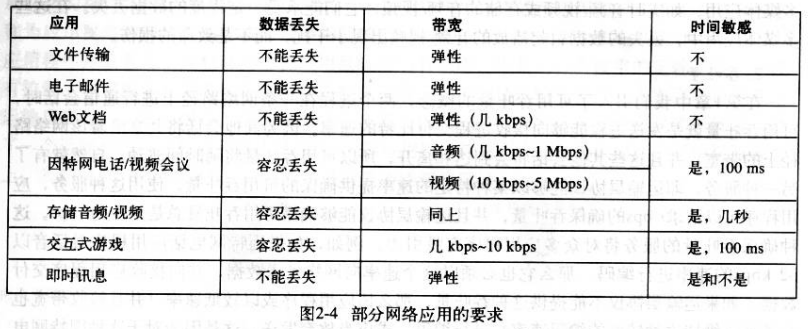
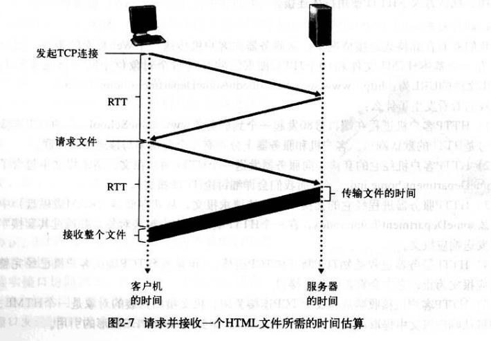
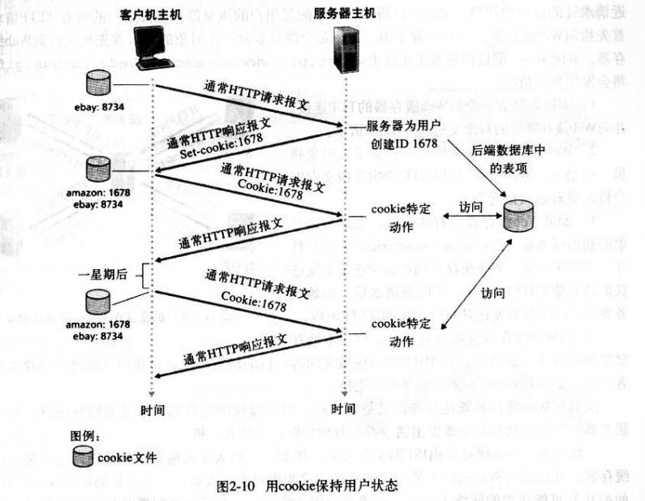
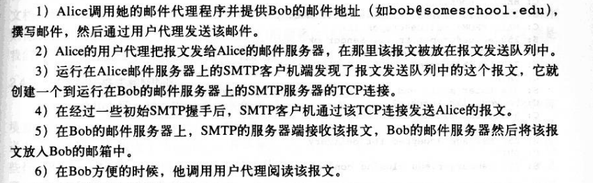

# chapter2 应用层
## 2.1 应用层协议原理
### 2.1.1 网络应用程序体系结构
> 客户机/服务器体系结构和P2P体系结构
* CS结构服务器具有固定的ip地址：Web，FTP，Telnet和email
* P2P：流量密集型应用程序，自扩展性
### 2.1.2 进程通信
> 应用程序开发者对于运输层的控制仅限于：
> 1.选择运输层协议
> 2.设定几个运输层参数
> 
### 2.1.3 可供应用程序使用的运输服务
> 可靠数据传输、吞吐量、定时和安全性
> 因特网上的应用主要使用两个运输层蜥蜴：UDP和TCP
> 
> __TCP服务__：面向连接服务，可靠数据传输服务，拥塞控制
> __UDP服务__：无连接，不可靠数据传输，一般实时应用
#### 进程寻址
> 该主机的名称或地址；指定目的主机上接收进程的标识（端口）
## 2.2 web应用和HTTP
### 2.2.3 HTTP
> 客户机->HTTP请求->服务器->HTTP响应->客户机（套接字接收）
> HTTP使用TCP作为支撑运输层协议
> 无状态协议
### 2.2.2
> 非持久连接：每个请求/响应对是经一个单独的TCP连接发送的
> RTT：前两次握手时间（来回）
> 
> 持久连接：所有的请求/响应对经相同的TCP连接发送（HTTP默认）
### 2.2.3 HTTP报文格式
> ....
### 2.2.4 cookie
> 定向推送
> 
### 2.2.5 Web缓存
> ....
## 2.3 FTP
> 使用两个并行的TCP连接传输文件：控制连接和数据连接
> 计网实验很清楚= =
## 2.4 SMTP
> __TCP服务__：面向连接服务，可靠数据传输服务，拥塞控制
> 邮件不会在中间服务器存留
> 
## 2.5 DNS
> 将用户提供的主机名解析为IP地址
## 2.6 P2P应用
