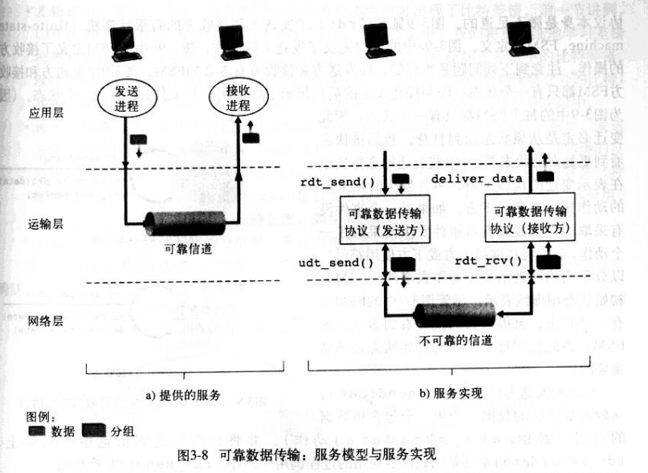
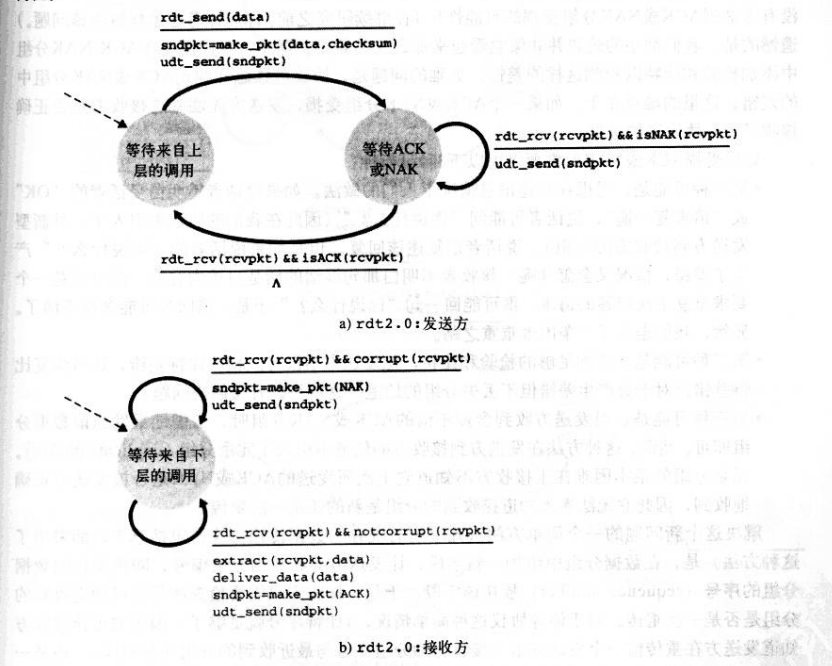
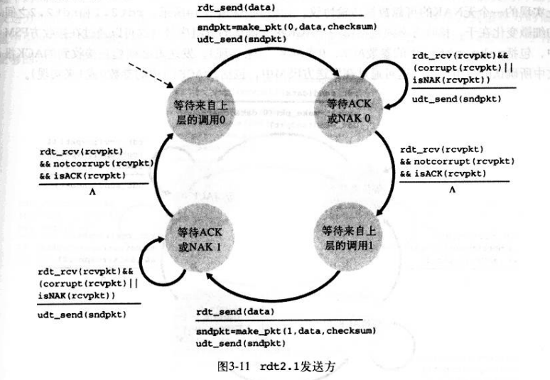
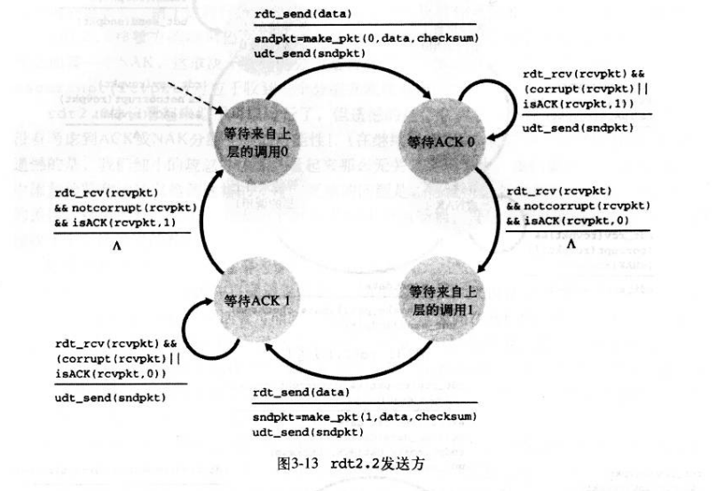
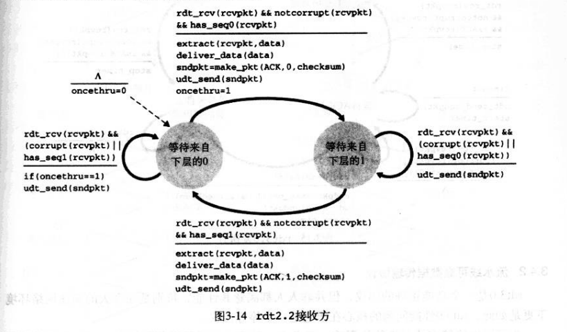

# chapter3 运输层

## 3.2 多路复用和多路分解
> 将运输层报文段中的数据交付到正确的套接字的工作称为多路分解。
> 从源主机的不同套接字中收集数据块，并为每个数据块封装上首部信息从而生成报文段并传递到网络层称为多路复用。

## 3.3 UDP
- 应用层能更好地控制要发送的数据和发送时间
- 无需连接建立（TCP要三次握手）
- 无连接状态
- 分组收不开销小（8bytes）TCP（20bytes）

> 校验和（钱16位不全0回卷至0，反码）

## 3.4 可靠数据传输
- 完全可靠信道上的可靠数据传输: rdt1.0
  
- 具有比特差错信道上的可靠数据传输：rdt2.0
  > ARQ协议：差错检测，接收方反馈，重传
  
- rdt2.1
  
  
- rdt2.2:无NAK的可靠数据传输协议
  
  
- 具有比特差错的丢包信道上的可靠数据传输：rdt3.0

__GBN和SR__