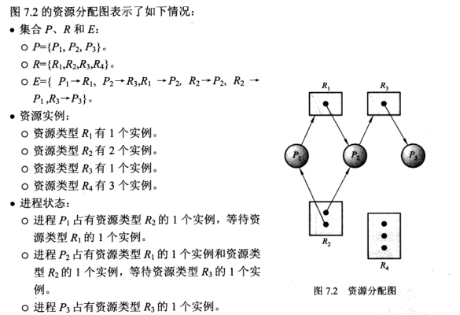

# chapter7 死锁
> 所申请的资源被其他等待进程占有，那么等待进程有可能再也无法改变其状态。

## 系统模型
  > 正常操作模式下，进程只能按如下顺序使用资源
  > 1. 申请：如果申请没有得到允许，则只能等待
  > 2. 使用：进程对该资源进行操作
  > 3. 释放：进程释放资源

## 死锁特征
### 必要条件
  > 1. 互斥：至少有一个资源必须处于非共享模式
  > 2. 占有并等待：一个进程必须占有至少一个资源，并等待另一个资源，而该资源为其他进程所占有
  > 3. 非抢占：资源只能在进程完后才能任务后自动释放
  > 4. 循环等待： 等待资源的进程形成环
### 资源分配图
  > 死锁问题可以用系统资源分配图来描述
  > 资源分配图由一组结点V（vertices）和一组边E（edge）构成
  > 结点可以分为两类：1、进程结点P（process）；	2、资源结点（resource）
  > 申请边：有向边P→R：进程P在等待资源R
  > 分配边：有向边R→P：资源P已经分配给进程P
  > #### 如果资源分配图无环，则一定不会有进程死锁
  > #### 如果资源分配图有环，则可能存在死锁
    1. 如果一个资源只有一个实例，则出现死锁
    2. 如果一个资源有多个实例，则不一定出现死锁

### 死锁预防
  > 1. 无法进入死锁（破坏四个必要条件中的任何一个）
       - 破坏占有且等待：要么就全部占有，要么就全部不占有。但是就可能出现资源利用率低，也可能出现饿死。
       - 非抢占变成抢占：成本高
       如果一个进程占有资源并且申请另一个不能分配到的资源，那么它将被移到等待队列上，并且它现在占有的资源都可以被抢占，也就是被隐式地释放了。
       进程申请资源时，如果该资源可用，则直接分配，如果不可用，则检测它是否已经分配给等待队列中的某个进程（也就是不是正在执行的进程），如果是，则从该进程抢占该资源，否则，这个进程会被挂到等待队列中。
       - 破坏循环等待：设置资源的使用顺序，这样会造成资源的使用率变低
       对所有资源类型进行排序，要求每个进程按递增顺序来申请资源，如果它已经先占有序号高的资源，必须先释放该资源。
  > 2. 允许进入死锁，但是可以恢复出来
  > 3. 可忽视这个问题，认为死锁不可能在系统内发生（Unix和Windows）

### 死锁避免
  > 首先有个安全状态，每走一步，就预先分配，然后进行安全状态的检测，如果安全则直接分配，如果不安全则不分配，换一种方式进行分配。

### 死锁的检测
  > 每一类资源只有一个实例的时候，删除资源结点，如果有环，则死锁，如果没有环，则没有锁。
  如果有死锁，那么就关闭进程。选择一个进程进行关闭，关闭之后再进行死锁检测，如果还有死锁则继续删除，否则不删除。

### 银行家算法
